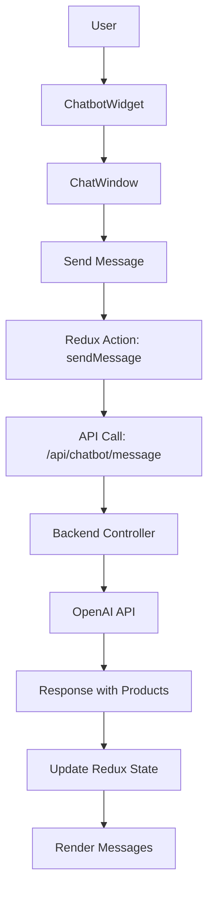
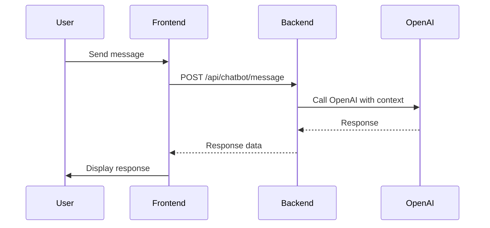

# AI Chatbot Feature Architecture Design

## Overview
This document outlines the high-level architecture for integrating an AI-powered chatbot into the e-commerce website. The chatbot will provide product recommendations and customer support using OpenAI's API, presented via a floating chat widget.

## Requirements
- **Purpose**: Handle product recommendations (e.g., "recommend fitness products") and customer support (e.g., "track my order").
- **UI**: Floating chat widget accessible from all pages.
- **AI Integration**: Use OpenAI API for conversational responses.
- **Backend**: New API endpoints to handle chatbot messages.
- **Data Flow**: Integrate with existing Redux state for products, cart, orders.
- **User Interactions**: Users can send messages, receive AI responses, and interact with product links.

## Components
### Frontend Components
- **ChatbotWidget**: Floating button (e.g., chat icon) in bottom-right corner.
- **ChatWindow**: Modal/sidebar displaying conversation history, input field, send button.
- **MessageBubble**: Component for rendering user and bot messages, with support for product links.

### Backend Components
- **Chatbot Route**: `/api/chatbot`
- **Chatbot Controller**: Handles message processing, OpenAI integration, context retrieval.

### Redux Integration
- New slice: `chatbotSlice.js`
  - State: `messages` (array of {id, text, sender: 'user'|'bot', timestamp}), `loading`, `error`
  - Actions: `sendMessage` (async thunk to call API)

## Data Structures
### Message Object
```javascript
{
  id: string,
  text: string,
  sender: 'user' | 'bot',
  timestamp: Date,
  products?: [{id, name, price, image}] // optional for recommendations
}
```

### API Request/Response
- POST `/api/chatbot/message`
  - Request: `{ message: string, userId?: string }`
  - Response: `{ response: string, products?: array }`

## User Interactions
1. User clicks floating widget to open chat.
2. User types message and sends.
3. Bot responds with text and optional product suggestions.
4. User can click product links to navigate to product detail.

## Data Flow
1. User input -> dispatch `sendMessage` action.
2. API call to backend with message and context (user data, products).
3. Backend queries OpenAI with system prompt including product data.
4. OpenAI returns response.
5. Backend parses response, fetches relevant products if needed.
6. Return response to frontend.
7. Update Redux state with new messages.
8. Re-render chat window.

## Integration Points
- **Redux Store**: Add chatbot reducer.
- **App.jsx**: Include ChatbotWidget globally.
- **Backend**: Add OpenAI API key to .env, install openai package.
- **Existing APIs**: Leverage product recommendations, search for context.

## Architecture Diagram


## Workflow Diagram


## Next Steps
- Implement backend OpenAI integration.
- Create frontend components.
- Add Redux slice.
- Test integration.